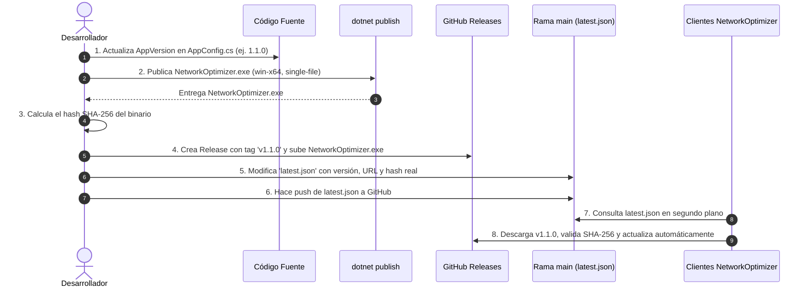

# Guía de Publicación y Despliegue de Actualizaciones (GitHub Releases)

Esta guía detalla el procedimiento paso a paso para publicar una nueva versión de **NetworkOptimizer** y activar la distribución automática hacia los clientes a través del repositorio oficial de GitHub:

**Repositorio oficial:** [https://github.com/ezearocha0-stack/NetworkOptimizer](https://github.com/ezearocha0-stack/NetworkOptimizer)  
**URL de manifiesto en clientes:** `https://raw.githubusercontent.com/ezearocha0-stack/NetworkOptimizer/main/latest.json`

---

## Flujo General de Actualización



---

## Procedimiento Paso a Paso para la Primera Release (v1.1.0)

### Paso 1: Modificar la Versión en el Código
En el archivo `NetworkOptimizer/Config/AppConfig.cs`, actualiza la versión del producto:
```csharp
public const string AppVersion = "1.1.0";
```

*(Opcional: Si el Updater sufrió cambios, también se publica, aunque normalmente `NetworkOptimizer.Updater.exe` no cambia entre versiones menores).*

---

### Paso 2: Publicar la Aplicación en Release (Self-Contained & Single-File)
Ejecuta el siguiente comando en la raíz del proyecto para compilar el ejecutable portable para Windows x64:

```powershell
dotnet publish NetworkOptimizer/NetworkOptimizer.csproj -c Release -r win-x64 --self-contained true -p:PublishSingleFile=true
```

El ejecutable generado quedará ubicado en:
`NetworkOptimizer\bin\Release\net8.0-windows\win-x64\publish\NetworkOptimizer.exe`

---

### Paso 3: Calcular el Hash Criptográfico SHA-256 Real
Abre PowerShell y calcula el hash del ejecutable generado:

```powershell
Get-FileHash -Algorithm SHA256 "NetworkOptimizer\bin\Release\net8.0-windows\win-x64\publish\NetworkOptimizer.exe" | Select-Object -ExpandProperty Hash
```

Copia la cadena hexadecimal obtenida (64 caracteres alfanuméricos).

---

### Paso 4: Crear la Release en GitHub
1. Ingresa a: [https://github.com/ezearocha0-stack/NetworkOptimizer/releases/new](https://github.com/ezearocha0-stack/NetworkOptimizer/releases/new)
2. En **Choose a tag**, escribe exactamente: `v1.1.0` (y selecciona crear nuevo tag al publicar).
3. En **Release title**, escribe: `NetworkOptimizer v1.1.0`.
4. En la descripción, detalla las mejoras o notas de la versión.
5. En el área de archivos adjuntos (**Attach binaries by dropping them here or selecting them**), arrastra y sube el archivo:
   `NetworkOptimizer.exe`
6. Haz clic en **Publish release**.

> [!IMPORTANT]
> La URL pública de descarga del archivo quedará exactamente como:
> `https://github.com/ezearocha0-stack/NetworkOptimizer/releases/download/v1.1.0/NetworkOptimizer.exe`

---

### Paso 5: Actualizar el Archivo `latest.json` en la Rama `main`
Crea o edita el archivo `latest.json` en la raíz del repositorio local con la siguiente información:

```json
{
  "version": "1.1.0",
  "downloadUrl": "https://github.com/ezearocha0-stack/NetworkOptimizer/releases/download/v1.1.0/NetworkOptimizer.exe",
  "sha256": "PEGA_AQUÍ_EL_HASH_CALCULADO_EN_EL_PASO_3"
}
```

---

### Paso 6: Subir `latest.json` a GitHub
Haz commit y push del archivo `latest.json` a la rama `main`:

```bash
git add latest.json
git commit -m "Actualizar manifiesto de autoactualización a v1.1.0"
git push origin main
```

---

### Paso 7: Detección y Actualización Automática por los Clientes
- Los usuarios que tengan instalada la versión `1.0.0` detectarán automáticamente la versión `1.1.0` al abrir la aplicación (o al comprobar actualizaciones).
- Aparecerá el botón **Actualizar** en la cabecera.
- Al pulsarlo, el cliente descargará el archivo desde GitHub Releases mediante HTTPS, comprobará que el hash coincida bit a bit con el de `latest.json`, ejecutará `NetworkOptimizer.Updater.exe`, y reemplazará el ejecutable de forma segura conservando íntegramente la licencia activa y configuración del usuario.
